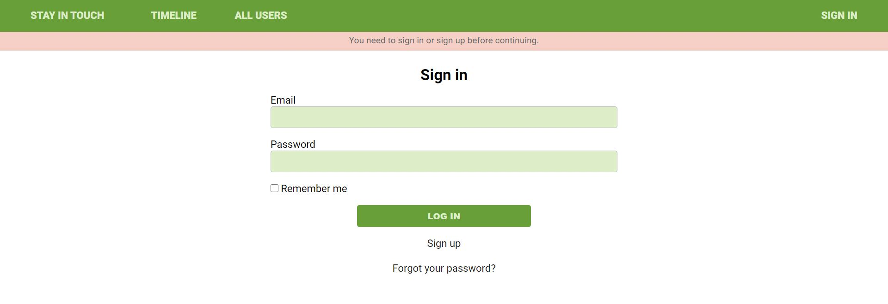
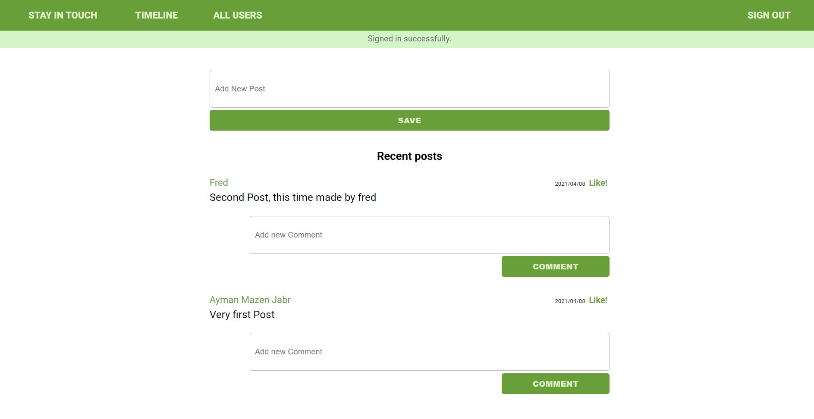
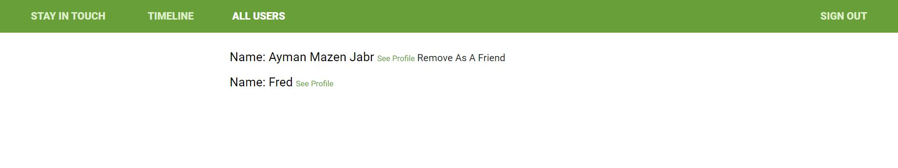

# Social media app with Ruby on Rails

This project is part of the Microverse Ruby on Rails training curriculum. In this project we created a a self-linking association for the User's table, in order to keep track of which users were friend with each other





## Built With

- Ruby v2.7.0
- Ruby on Rails v6.1.0

## Live Demo

[here](https://dry-wildwood-47175.herokuapp.com/).


## Getting Started

To get a local copy up and running follow these simple example steps.

### Prerequisites

Ruby: 2.6.3
Rails: 5.2.3
Postgres: >=9.5

### Setup

Instal gems with:

```
bundle install
```

Setup database with:

```
   rails db:create
   rails db:migrate
```

### Github Actions

To make sure the linters' checks using Github Actions work properly, you should follow the next steps:

1. On your recently forked repo, enable the GitHub Actions in the Actions tab.
2. Create the `feature/branch` and push.
3. Start working on your milestone as usual.
4. Open a PR from the `feature/branch` when your work is done.


### Usage

Start server with:

```
    rails server
```

Open `http://localhost:3000/` in your browser.

### Run tests

run `sudo apt-get install chromium-chromedriver` to install chromium-chromedriver

```
    rspec --format documentation
```

> Tests will be added by Microverse students. There are no tests for initial features in order to make sure that students write all tests from scratch.

### Deployment

TBA

## Authors :bust_in_silhouette:
### Ayman Jabr
\_[Github: @AymanJabr](https://github.com/AymanJabr/)
\_[LinkedIn: @Ayman Jabr](https://www.linkedin.com/in/ayman-jabr/)
### Frederick Mih
\_[Github: @FrederickMih](https://github.com/FrederickMih)
\_[LinkedIn: @Mih Frederick](https://www.linkedin.com/in/frederick-mih/)

## 🤝 Contributing

Contributions, issues and feature requests are welcome!

Feel free to check the [issues page](https://github.com/AymanJabr/Social-Media-Website-RubyOnRails/issues).

## Show your support

Give a ⭐️ if you like this project!

## 📝 License

### Released under MIT License

Copyright (c) 2021 Ayman Jabr.

Permission is hereby granted, free of charge, to any person obtaining a copy of this software and associated documentation files (the "Software"), to deal in the Software without restriction, including without limitation the rights to use, copy, modify, merge, publish, distribute, sublicense, and/or sell copies of the Software, and to permit persons to whom the Software is furnished to do so, subject to the following conditions:

THE SOFTWARE IS PROVIDED "AS IS", WITHOUT WARRANTY OF ANY KIND, EXPRESS OR IMPLIED, INCLUDING BUT NOT LIMITED TO THE WARRANTIES OF MERCHANTABILITY, FITNESS FOR A PARTICULAR PURPOSE AND NONINFRINGEMENT. IN NO EVENT SHALL THE AUTHORS OR COPYRIGHT HOLDERS BE LIABLE FOR ANY CLAIM, DAMAGES OR OTHER LIABILITY, WHETHER IN AN ACTION OF CONTRACT, TORT OR OTHERWISE, ARISING FROM, OUT OF OR IN CONNECTION WITH THE SOFTWARE OR THE USE OR OTHER DEALINGS IN THE SOFTWARE.

